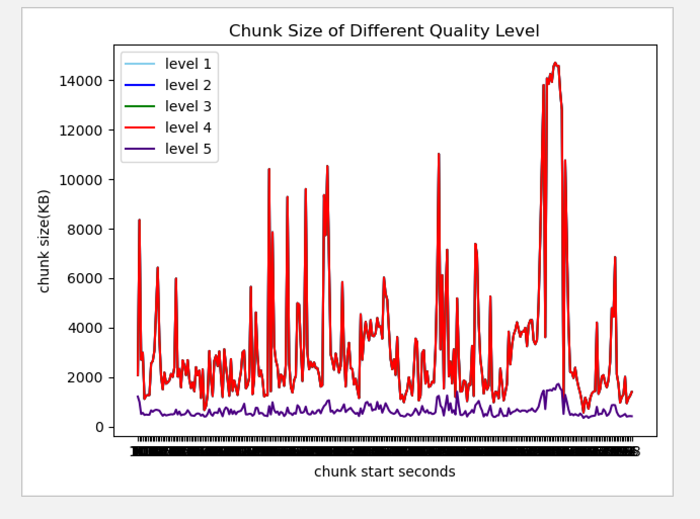
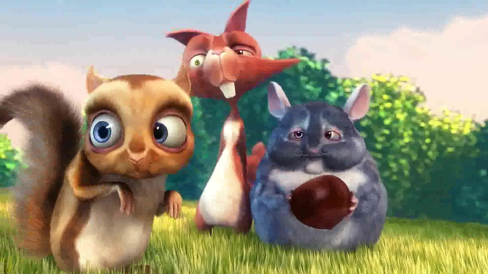

# 实验步骤
1. 将原视频转成level5的视频 level5.avi
2. 将level5.avi切成大小是2s的chunk
3. 将level5的chunks依此转成level 4~1的chunks，并统计时间
4. 依次将level4的chunks依次转化成level 3~1，并统计转码时间
5. 直到level 2的chunks全部转化成level 1，并统计转码时间

6. 统计level5，和level5转成level 4~1的各chunk的大小的平均值，方差，协方差

7. 挑选整片第120s处的视频，通过ffmpeg截图出来，并拼接到一个visio中。

# 结果整理

### 实验条件

- ffmpeg 
  - Version： 4.2.2
  - available：http://ffmpeg.org
- video source
  - available：http://www.bigbuckbunny.org
  - [big_buck_bunny_1080p_surround](http://mirrorblender.top-ix.org/peach/bigbuckbunny_movies/big_buck_bunny_1080p_surround.avi) 1920*1080 (16:9) 12.0Mbps 24fps
- windows (in VM fusion)
  - version：win10 64bits
  - CPU：Intel(R) Core(TM) i5-5257U CPU@2.7Hz @2.7Hz
  - memory：2G
  - python：
    - version：Python 3.8.1
- chunk
  - duration : 2s

### 视频质量

| quality level | bitrate(bps) | resolution (copy) |
| :-----------: | :----------: | :---------------: |
|       1       |     100K     |     1920*1280     |
|       2       |     300K     |     1920*1280     |
|       3       |     600K     |     1920*1280     |
|       4       |     900K     |     1920*1280     |
|       5       |    1500K     |     1920*1280     |

### 转码时间

| src level | des level | avg time(ms) |
| :-------: | :-------: | :----------: |
|     5     |     4     |    713.44    |
|     5     |     3     |   1119.14    |
|     5     |     2     |   1493.22    |
|     5     |     1     |   1855.44    |
|     4     |     3     |    733.53    |
|     4     |     2     |   1104.43    |
|     4     |     1     |   1449.62    |
|     3     |     2     |    727.01    |
|     3     |     1     |   1120.75    |
|     2     |     1     |    751.68    |

### chunk size

level 5是由1080p 24fps的源文件转码分割而来

level1～4是由level5转码而来

| level | avg size（KB）(level5 - level k,k=4,3,2,1) |  variance  | covariance |
| :---: | :----------------------------------------: | :--------: | :--------: |
|   1   |                  3264.03                   | 8076266.17 | 8103458.99 |
|   2   |                  3264.03                   | 8076266.17 | 8103458.98 |
|   3   |                  3264.03                   | 8076266.17 | 8103458.98 |
|   4   |                  3264.03                   | 8076266.17 | 8103458.98 |
|   5   |                  3477.03                   | 9311807.77 | 9343160.66 |

### 截图
- 来源：chunk：118-120.avi的最后一帧

| level | size（KB） | resolution | image |
| :---: | :----------------------------------------: | :------: | :--------: |
|   1   |   58.1         |    1920*1280        |        |
|   2   | 58.1 | 1920*1280  |     |
|   3   | 58.1 | 1920*1280  |     |
|   4   | 58.1 | 1920*1280  |        |
|   5   | 58.5 | 1920*1280  |        |

